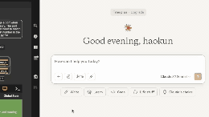

# MaxMSP-MCP Server

This project uses the [Model Context Protocol](https://modelcontextprotocol.io/introduction) (MCP) to let LLMs directly understand and generate Max patches.

### Understand: LLM Explaining a Max Patch


[Video link](https://www.youtube.com/watch?v=YKXqS66zrec). Acknowledgement: the patch being explained is downloaded from [here](https://github.com/jeffThompson/MaxMSP_TeachingSketches/blob/master/02_MSP/07%20Ring%20Modulation.maxpat). Text comments in the original file are deleted.

### Generate: LLM Making an FM Synth


Check out the [full video](https://www.youtube.com/watch?v=Ns89YuE5-to) where you can listen to the synthesised sounds.

The LLM agent has access to the official documentation of each object, which helps in retrieving and explaining objects, debugging, and verifying their own actions.

## Installation  

### Prerequisites  

 - Python 3.8 or newer  
 - [uv package manager](https://github.com/astral-sh/uv)  
 - Max 9 or newer (because some of the scripts require the Javascript V8 engine), we have not tested it on Max 8 or earlier versions of Max yet.  

### Installing the MCP server

1. Install uv:
```
# On macOS and Linux:
curl -LsSf https://astral.sh/uv/install.sh | sh
# On Windows:
powershell -ExecutionPolicy ByPass -c "irm https://astral.sh/uv/install.ps1 | iex"
```
2. Clone this repository and open its directory:
```
git clone https://github.com/tiianhk/MaxMSP-MCP-Server.git
cd MaxMSP-MCP-Server
```
3. Start a new environment and install python dependencies:
```
uv venv
uv pip install -r requirements.txt
```
4. Connect the MCP server to a MCP client (which hosts LLMs):
```
# Claude:
python install.py --client claude
# or Cursor:
python install.py --client cursor
```
To use other clients (check the [list](https://modelcontextprotocol.io/clients)), you need to download, mannually add the configuration file path to [here](https://github.com/tiianhk/MaxMSP-MCP-Server/blob/main/install.py#L6-L13), and connect by running `python install.py --client {your_client_name}`.

### Installing to a Max patch  

Use or copy from `MaxMSP_Agent/demo.maxpat`. In the first tab, click the `script npm version` message to verify that [npm](https://github.com/npm/cli) is installed. Then click `script npm install` to install the required dependencies. Switch to the second tab to access the agent. Click `script start` to initiate communication with Python. Once connected, you can interact with the LLM interface to have it explain, modify, or create Max objects within the patch.

## Disclaimer

This is a third party implementation and not made by Cycling '74.
